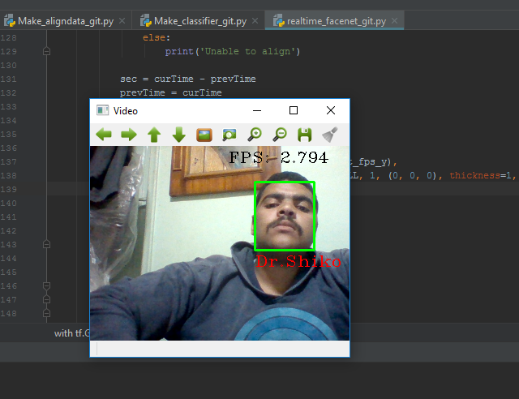

# real-time-deep-face-recogniton

Real-time face recognition program using Google's facenet.
* [youtube video](https://www.youtube.com/watch?v=T6czH6DLhC4)
## Dependencies
* Tensorflow 1.2.1 - gpu
* Python 3.5
* Same as [requirement.txt](https://github.com/davidsandberg/facenet/blob/master/requirements.txt) in [davidsandberg](https://github.com/davidsandberg/facenet) repository.
## Pre-trained models
* Inception_ResNet_v1 CASIA-WebFace-> [20170511-185253](https://drive.google.com/file/d/0B5MzpY9kBtDVOTVnU3NIaUdySFE/edit)
## Face alignment using MTCNN
* You need [det1.npy, det2.npy, and det3.npy](https://github.com/davidsandberg/facenet/tree/master/src/align) in the [davidsandberg](https://github.com/davidsandberg/facenet) repository.
## Note that 
* the data isn't uploaded here.
* to try this you need to make sure of all needed dependencies.
* Finally, download the pretrained model.
## Result

